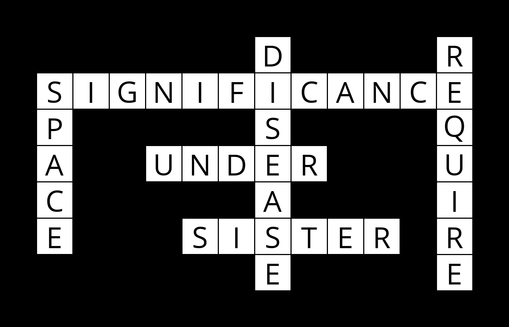

# Crossword AI

## Description
This Python script leverages AI to intelligently complete crossword puzzles by employing a constraint satisfaction model. The code applies a backtracking search algorithm to determine the optimal word placements within the puzzle's empty slots. 

## Visual
